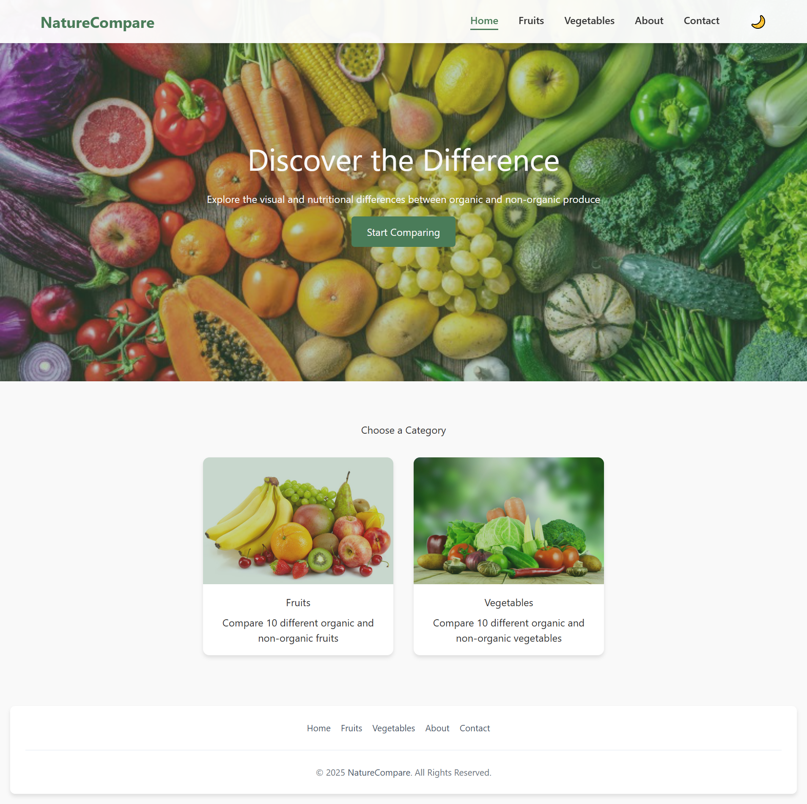
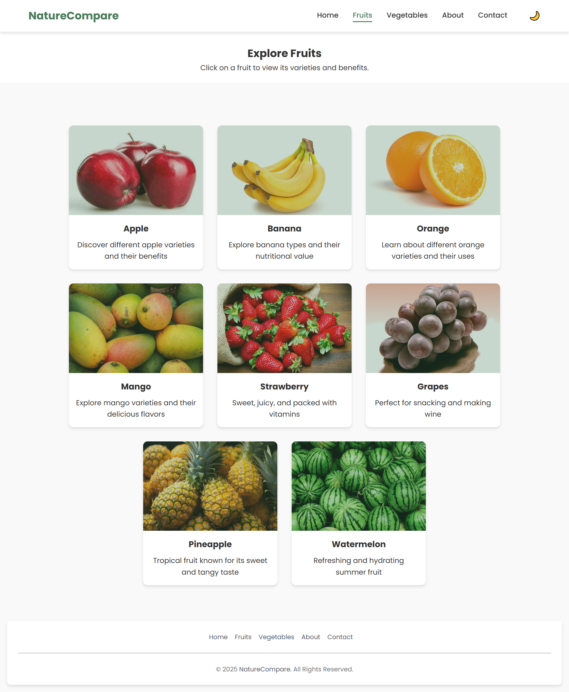
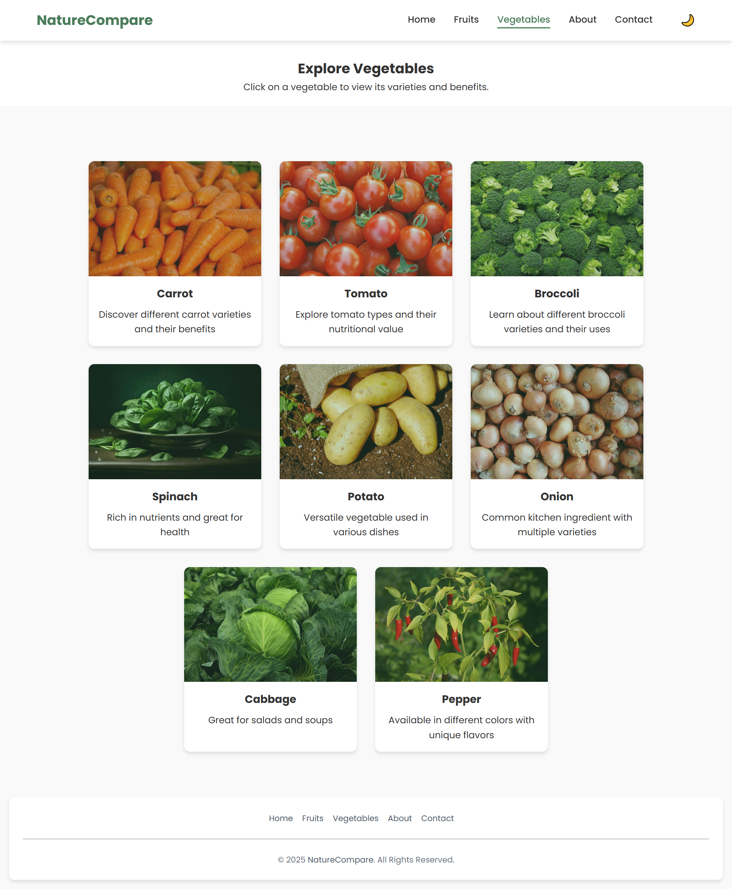
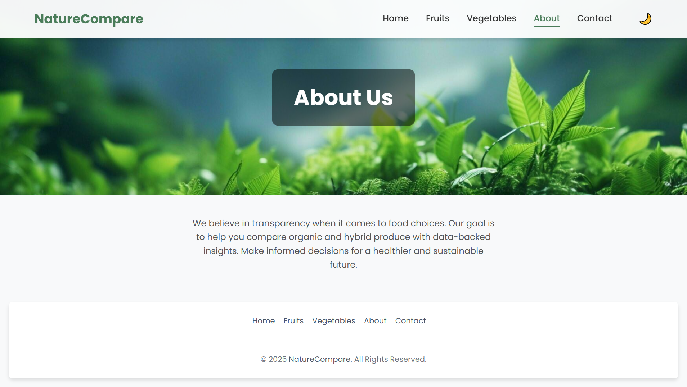
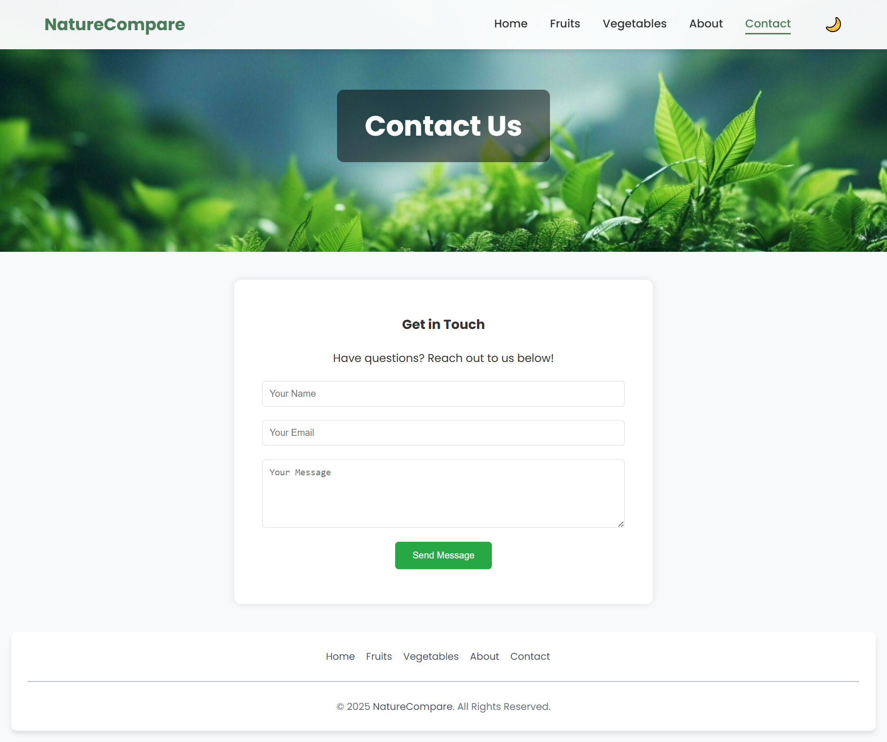

# Fruits & Vegetables Variety Comparison Website

  

Welcome to the **Fruits & Vegetables Variety Comparison Website**! This project is designed to provide detailed comparisons of various fruits and vegetables, their varieties, health benefits, and other useful information.

  

---

  

## 🌟 Features

-  **Home Page**: Overview of the website and navigation to different sections.

-  **Fruits Section**: Explore a variety of fruits and their detailed comparisons.

-  **Vegetables Section**: Learn about different vegetables and their varieties.

-  **About Page**: Information about the purpose of the website.

-  **Contact Page**: Get in touch with the creators of the website.

-  **Dark Mode**: Toggle between light and dark themes for better user experience.

  

---

  

## 📂 Folder Structure

  

```

Fruits_Vegitable_Varity_Comparision/

├── about.html # About Us page

├── contact.html # Contact Us page

├── fruits.html # Fruits overview page

├── global-css-cards.css # Global CSS for card components

├── index.html # Home page

├── README.md # Project documentation

├── script.js # JavaScript for dynamic functionality

├── style.css # Main stylesheet

├── varity-css.css # Styles for variety-specific pages

├── vegetables.html # Vegetables overview page

├── fruits_list/ # Individual fruit pages

│ ├── apple.html

│ ├── banana.html

│ ├── grapes.html

│ ├── mango.html

│ ├── orange.html

│ ├── pineapple.html

│ ├── strawberry.html

│ └── watermelon.html

├── fruits_variety_set/ # Detailed fruit variety pages

│ ├── apple_varieties/

│ ├── banana_varities/

│ ├── grapes_varieties/

│ ├── mango_varieties/

│ ├── orange_varities/

│ ├── pineapple_varieties/

│ ├── strawberry_variety/

│ └── watermelon-varieties/

├── images/ # Images used in the website

├── vegetables_list/ # Individual vegetable pages

├── vegetables_varity_set/ # Detailed vegetable variety pages

└── website_screenshots/ # Screenshots of the website

```

  

---

  

## 📸 Website Screenshots

  

### Home Page



  

### Fruits Section



  

### Vegetables Section



  

### About Page



  

### Contact Page



  

---

  

## 🚀 How to Run the Project

  

1. Clone the repository or download the project files.

2. Open the `index.html` file in your browser to view the website.

3. Navigate through the pages using the navigation bar.

  

---

  

## 🛠️ Technologies Used

  

-  **HTML5**: For structuring the content.

-  **CSS3**: For styling the website.

-  **JavaScript**: For dynamic functionality (e.g., dark mode, hamburger menu).

-  **LocalStorage**: To persist user preferences (e.g., dark mode).

  

---

  

## 🌐 Live Demo


https://baskar2005-fruits-veggies-ui.static.hf.space/

---

  

## 📝 License

  

This project is licensed under the MIT License. Feel free to use and modify it as needed.