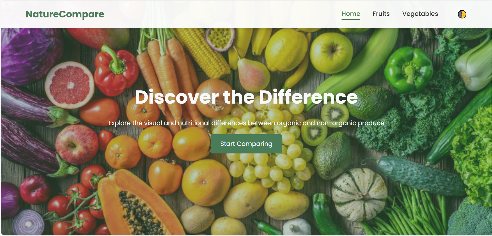
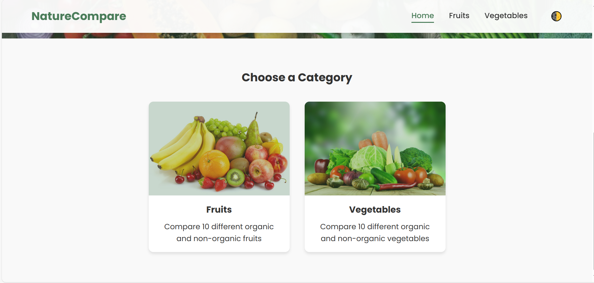
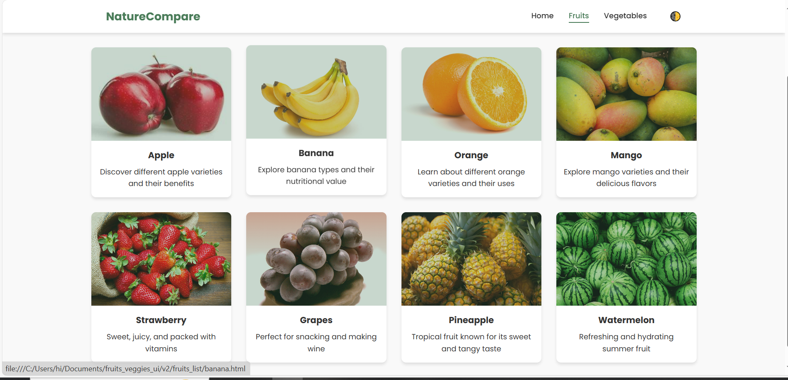
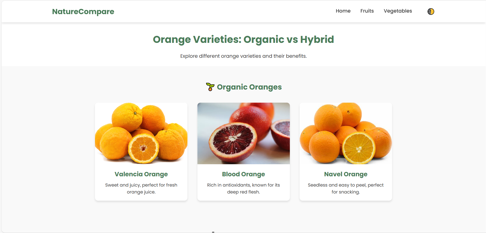
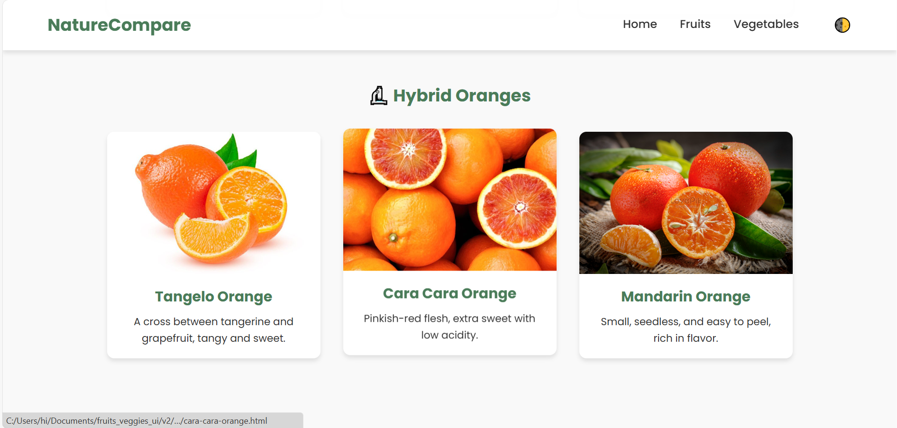
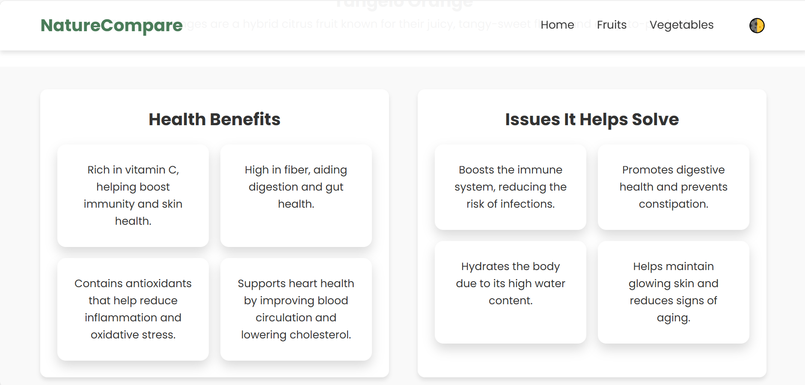

# Fruits & Vegetable Variety Comparison

## Project Overview
The **Fruits & Vegetable Variety Comparison** project is a web-based platform that provides a structured comparison of different varieties of fruits and vegetables. It highlights health benefits, issues solved, and nutritional value using **HTML, CSS, and JavaScript** to create an interactive user experience.

## Features
- **Comparison of Organic vs Hybrid Produce**
- **Individual pages for each variety**
- **Mobile-responsive UI with Dark Mode**
- **Easy navigation and structured categories**

---

## File Structure

### `index.html`
This is the homepage of the project, which serves as an entry point to navigate to fruits and vegetables sections.

#### Key Elements:
- Header with project title and navigation menu
- Links to `fruits.html` and `vegetables.html`
- A brief project description

### `fruits.html`
This page lists different types of fruits with links to their individual pages.

#### Key Elements:
- List of fruits
- Navigation menu for easy browsing

### `vegetables.html`
Similar to `fruits.html`, this page lists different types of vegetables with links to their respective pages.

### `style.css`
Contains the styling for all pages.

#### Main Styling Features:
- Responsive layout
- Dark mode support
- Navigation bar styling

### `script.js`
Adds interactivity, such as the dark mode toggle.

#### Functions:
- Enables dark mode toggle feature
- Enhances user experience with interactive elements

### `images/`
Contains images of different fruits and vegetables for comparison purposes.

### `README.md`
This file contains detailed information about the project, including file descriptions and usage instructions.

---

## Installation & Usage
```sh
# Clone the repository
git clone https://github.com/Baskar-forever/Fruits_Vegitable_Varity_Comparision.git

# Open index.html in any web browser
```
---
## Screenshots
Below are some screenshots from the project:

### Homepage



### Fruits Section




### Orange Variety Comparison




---

## Future Enhancements
- Adding **user reviews and ratings** for varieties.
- Implementing **a search feature** for quick access.
- Including **AI-powered recommendations** based on dietary preferences.

---

## Contributors
- **[Your Name]** – Developer & Designer

---

## License
This project is open-source and available under the **MIT License**.

---

## References
- Research papers on organic vs hybrid produce
